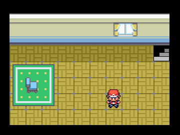

Robogame
========

###HTML5 Robo Game

Originally created this in 2013 to help [Andrew Gnagy](https://github.com/AndrewGnagy) and [Arjun Kiran](https://github.com/Arjun-Kiran) learn about HTML5 and Javascript. It's more or less a Pokemon clone where the player collects and assembles robots and uses them to battle in a futuristic fantasy world.

Updated in 2019 to suck slightly less

